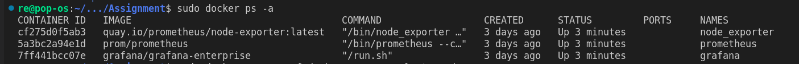
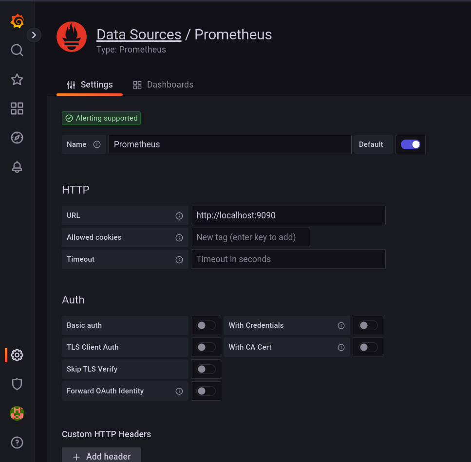
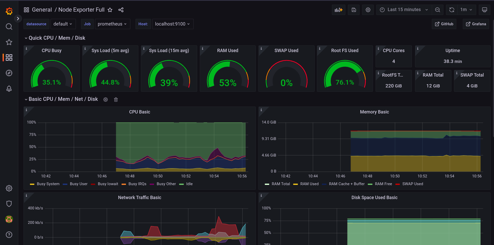

# Grafana-Prometheus-NodeExporter

## Ports

- Node exporter [`localhost:9100`]: Exposes a hardware metrics like CPU usages, Memory usages,...
- Prometheus [`localhost:9090`]: Scrapes metrics from the running Node Exporter as time series data.
- Grafana [`localhost:3000`]: Visualizes metrics, logs, and traces from multiple sources like Prometheus, Loki, Elasticsearch, InfluxDB, Postgres and many more.

## How to run

```Shell
sudo docker compose -f docker-compose.yml up -d
```

This will start 3 docker containers `node_exporter`, `prometheus`, `grafana`



## Open Grafana

- Open a link `localhost:3000` to access Grafana
- The default login is "admin" | "admin".

## Set up Grafana

<details>
<summary>Create a datasource (Prometheus)</summary>

</details>

<details>
<summary> Download a Grafana dashboard template: <a href="https://grafana.com/grafana/dashboards/1860-node-exporter-full/">Node Exporter Full</a> </summary>
</details>

<details>
<summary> Create a dashboard from the template. </summary>

</details>

<details>
<summary> Restart dockers. </summary>
</details>

## How to restart
```Shell
sudo docker compose -f docker-compose.yml restart
```

## How to stop

```Shell
sudo docker compose -f docker-compose.yml stop
```

## Tested environments

- Ubuntu 22.04 [5.19.0-76051900-generic]
- Docker version 20.10.19


## Process exporter

- Ref: https://github.com/ncabatoff/process-exporter
- Run this command to start

```bash
  process-exporter -config.path filename.yml
```
